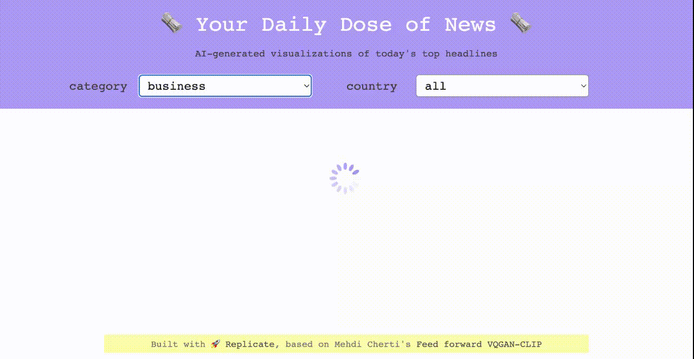
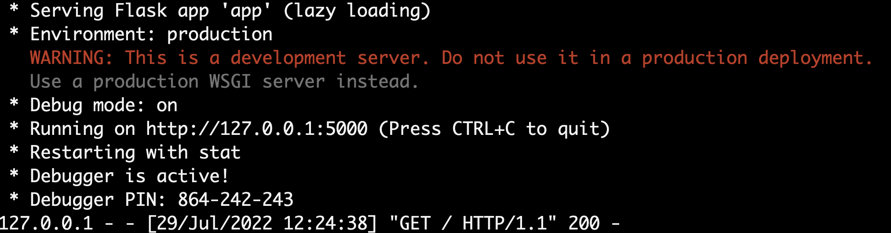
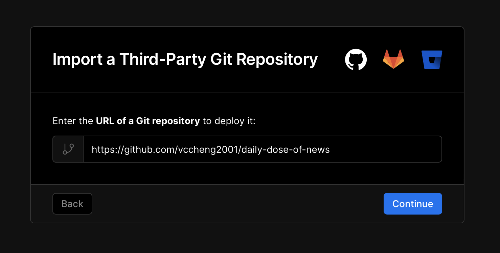
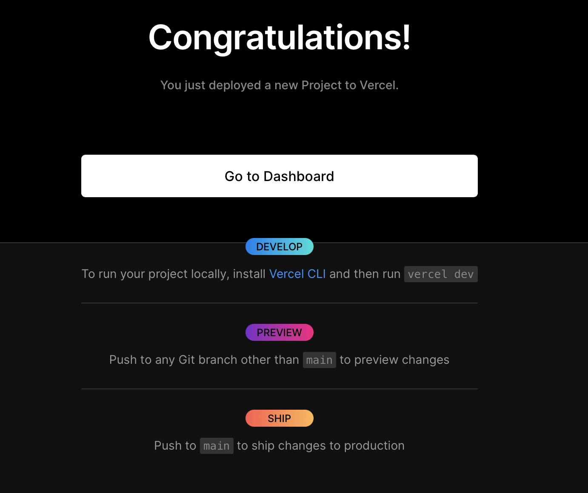
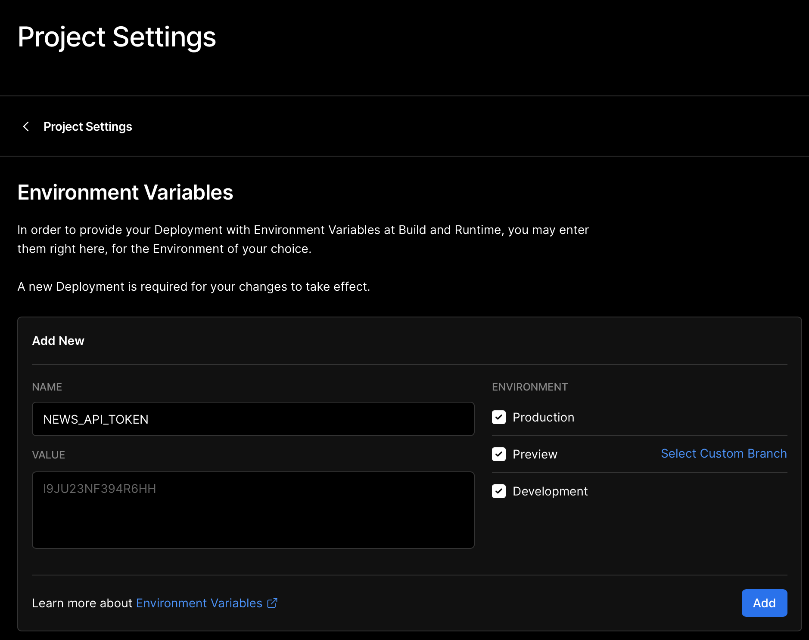
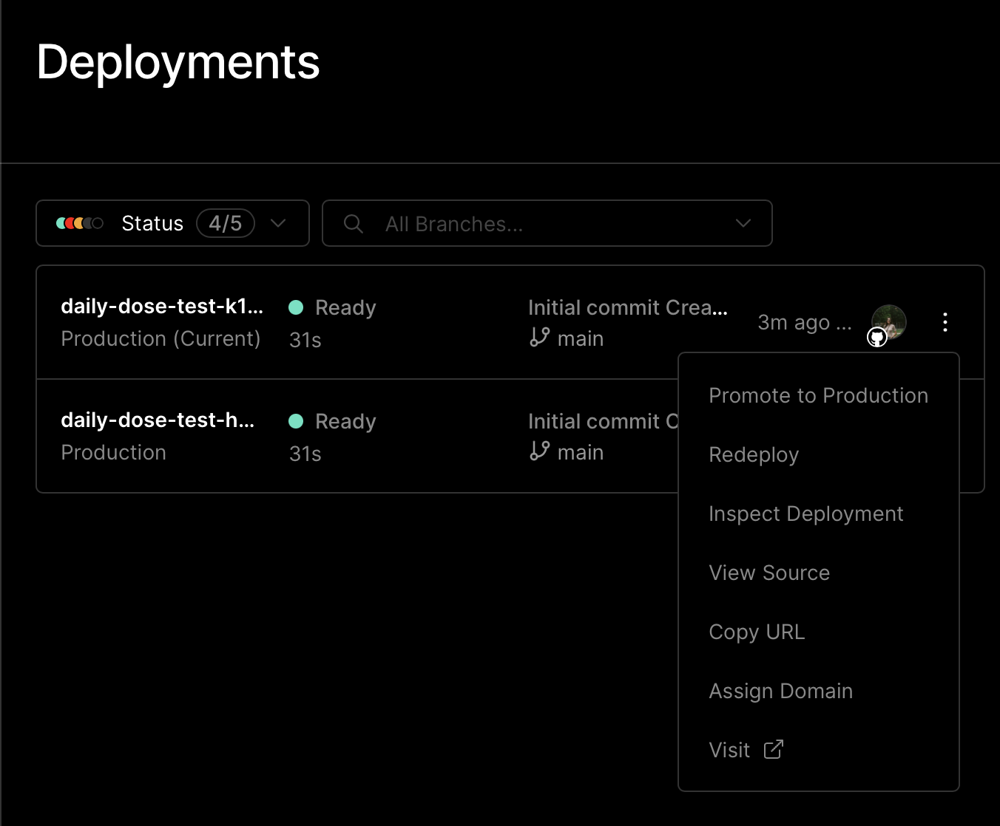

# Daily Dose of News with Replicate's API, Flask, and Vercel

:star: [Website](https://daily-dose-of-news-vccheng2001.vercel.app/) | :computer: [Repo](https://github.com/vccheng2001/daily-dose-of-news) | :rocket: [Model on Replicate](https://replicate.com/mehdidc/feed_forward_vqgan_clip)

_An interactive news feed that renders AI-generated visualizations of today's top headlines. The visualizations are generated using [VQGAN-CLIP](https://replicate.com/mehdidc/feed_forward_vqgan_clip) on [Replicate](https://replicate.com)._ 



**Note**: The first time you load the page up will take some time for the article to show up (as the servers take time to spin up). 

**Note**: The NewsAPI collects limited number of articles from limited countries/sources a day; thus some queries may not work.

## Tutorial: Build a web application that uses the Replicate API

With Daily Dose of News as an example project, this tutorial describes how to build a Replicate web application in Flask and deploy it on Vercel. Feel free to copy and paste code from here into your own project!

**Table of Contents**

- [Step 1: Fork this repository and clone it](#step-1-fork-this-repository-and-clone-it)
- [Step 2: Set up a virtual environment](#step-2-set-up-a-virtual-environment)
- [Step 3: Get your Replicate token](#step-3-get-your-replicate-token)
- [Step 4: Get your NewsAPI token](#step-4-get-your-newsapi-token)
- [Step 5: Set up your environment variables](#step-5-set-your-environment-variables)
- [Step 6: Run the app locally](#step-6-run-the-app-locally)
- [Step 7: Modify the code](#step-7-modify-the-code)
- [Step 8: Make a Vercel account](#step-8-make-a-vercel-account)
- [Step 9: Deploy on Vercel](#step-9-deploy-on-vercel)

### Step 1: Fork this repository and clone it

Make your own fork of https://github.com/vccheng2001/daily-dose-of-news and clone it to your local computer.

### Step 2: Set up a virtual environment

From the command line, `sh` into the cloned repository, and set up a virtual environment with the required packages specified in `requirements.txt`. You can either use `venv` or `conda` as an environment manager.

#### venv

```sh
python3 -m venv .venv
source .venv/bin/activate
pip install -r requirements.txt
```

#### conda
```sh
conda create -n myenv
conda activate myenv
pip install -r requirements.txt
```

### Step 3: Get your Replicate token

Go to [https://replicate.com/account](https://replicate.com/account) and sign up for the paid plan if you haven't already. You need to be on the paid plan to use the API. Once you've signed up, you can find your API token on your account page.

### Step 4: Get your NewsAPI token

You'll also need to generate a [NewsAPI token](https://newsapi.org/) to run the web application. You can get a developer token for free.

### Step 5: Set your environment variables

You can simply set your environment variables in the command line to get the app running locally.

```sh
export REPLICATE_API_TOKEN=<my-replicate-api-token>
export NEWS_API_TOKEN=<my-news-api-token>
```

### Step 6: Run the app locally

Run ```python app.py```, and open at the specified host. It should be http://localhost:5000.



### Step 7: Modify the code 

You can modify the code as you'd like! To edit front-end appearance, check out `index.css` and `index.css`.

### Step 8: Make a Vercel account

Create an account on Vercel. You can create an account through your GitHub account.

### Step 9: Deploy on Vercel

If you've created a new account, you'll be prompted to import a third-party GitHub repository. Insert https://github.com/vccheng2001/daily-dose-of-news.



Then, create a GitHub repository to ensure that you can easily update the project after deploying it.


Vercel will then automatically deploy the project.



Even though Vercel automatically deployed the project, the environment variables still aren't set. Make sure to set Environment Variables under "Project Settings" (in this case, ```NEWS_API_TOKEN``` and ```REPLICATE_API_TOKEN```). 



You'll need to redeploy the project for the change to take effect. To redeploy the project, click "Redeploy" on the menu next to your current deployment.



___

🎉 That's it! You've made a web application that calls the Replicate API and is deployed on Vercel. Let us know what you built in https://discord.gg/replicate!

